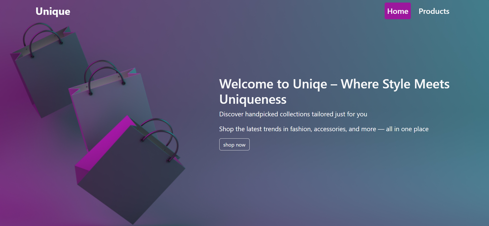
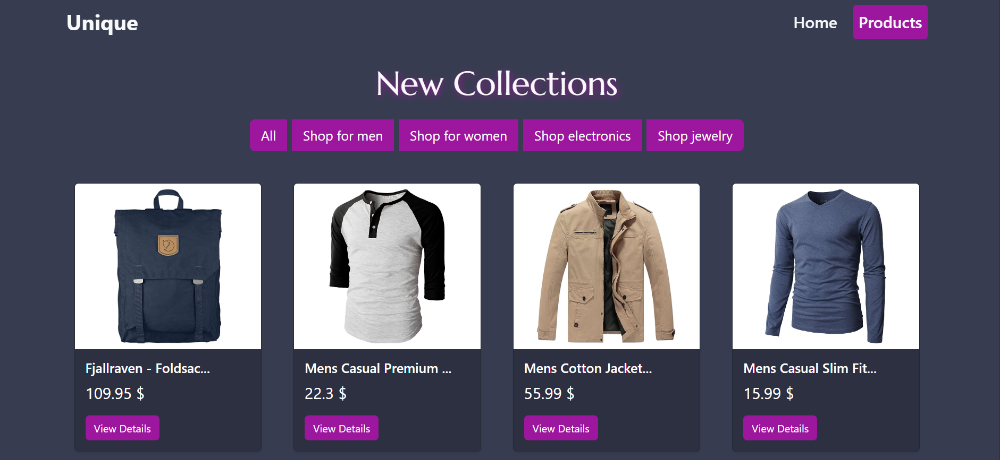
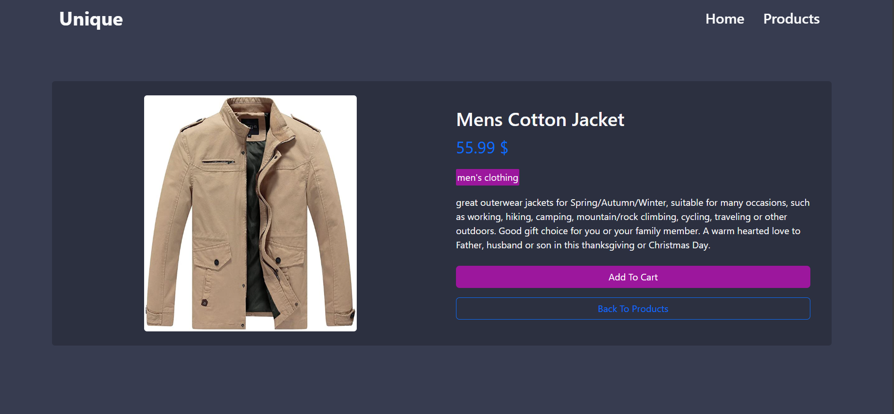

# React E-Commerce Store 🛍️

## Overview
React E-Commerce Store is a modern web application built with React. The application is designed to be a unique store where users can browse products, view detailed information, and navigate the site through a clean and responsive user interface. It demonstrates effective use of React components, state management, routing, and API integration.

---

## Features ✅

- 🧭 **Responsive Navigation**: A dynamic navbar that changes its background and adds shadow when scrolling to enhance user experience.
- 🛒 **Product Display**: A grid layout showing product cards with images, titles, and prices.
- 🔗 **Dynamic Routing**: Uses React Router for seamless navigation between pages.
- 📄 **Product Details**: A detailed product page that fetches data based on URL parameters.
- 🌐 **External API Integration**: Fetches product data from the Fake Store API using Axios.
- 🎨 **Custom Styling**: Uses CSS variables and custom classes for a unique and clean design.

---

## Technologies Used 🛠️

### Frontend
- **React**: JavaScript library for building user interfaces.
- **React Router DOM**: For handling client-side routing.
- **Axios**: HTTP client for making API requests.
- **Bootstrap**: For responsive layout and components.
- **CSS**: Custom styles for all pages and components.
- **Vite**: Development build tool for faster and optimized workflow.

---

## Getting Started 🚀

### Prerequisites
- Node.js (v14 or higher)
- npm 

### Installation

1. Clone the repository:
```bash
git clone <repository_url>
cd <repository_folder>
```
### Install dependencies: 
npm install

### Run the development server :
npm run dev

### Open in browser:
http://localhost:5173

## Screenshots 🖼️

### 🏠 Home Page


### 🛍️ Products Page


### 🛍️ Product Page  



## Project Structure 📁

```plaintext
Project Root
├── public/
├── src/
│   ├── assets/
│   │   └── images/
│   │       └── dark-background.jpg
│   ├── components/
│   │   ├── Home/
│   │   │   ├── Home.jsx
│   │   │   └── home.css
│   │   ├── Layout/
│   │   │   └── Layout.jsx
│   │   ├── Loader/
│   │   │   └── Loader.jsx
│   │   ├── Navbar/
│   │   │   ├── Navbar.jsx
│   │   │   └── navbar.css
│   │   ├── ProductCard/
│   │   │   └── ProductCard.jsx
│   │   ├── ProductPage/
│   │   │   ├── ProductPage.jsx
│   │   │   └── productPage.css
│   │   └── Products/
│   │       ├── Products.jsx
│   │       └── products.css
│   ├── App.jsx
│   └── App.css
├── package.json
└── vite.config.js
```


## Component Documentation 🧩

### App.jsx
The main component that sets up routing for the home page (/), products page (/products), individual product page (/product/:id), and 404 Not Found route.

### Layout.jsx
A layout wrapper that includes the Navbar and uses Outlet from React Router to display page content.

### Navbar.jsx
Navigation bar that uses NavLink for routing and changes appearance when scrolling.

### Home.jsx
Landing page with a "Shop Now" button that navigates to the products page.

### Products.jsx
Displays all products fetched from the Fake Store API.

### ProductCard.jsx
Reusable card component showing product image, title, price, and a button to view more details.

### ProductPage.jsx
Displays detailed information for a specific product using useParams to get the product ID from the URL.

### App.css
Global styles including color variables, fonts, and background settings.

### navbar.css
Styles specific to the Navbar, including scroll effects.

### products.css
Styling for the products grid, cards, buttons, and hover effects.

### productPage.css
Custom styles for the product detail layout and badge

### Loader.jsx
A reusable loading spinner component that appears while data is being fetched from the API.


## Theme & Colors 🎨
   #373c50  
   #9c179d 
   rgba(0, 0, 0, 0.2)   


## License
MIT

## Acknowledgements
- [Fake Store API](https://fakestoreapi.com/) for providing the product data
- [React](https://reactjs.org/) for the amazing library
- [Vite](https://vitejs.dev/) for the blazing fast build tool
- [Bootstrap](https://getbootstrap.com/) for the responsive design framework


## links 
- GitHub Repository: [View on GitHub](https://github.com/mennamohamed-60/graduation-project-iti)
- Live Demo (Hosted on Vercel): [View Live](https://graduation-project-iti-psi.vercel.app/)
